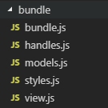

# 前端框架

前端开发框架，快速构建 SPA 应用，封装应用 App/页面 Page/区块 block/bundle 代码层级

_框架提供了路由的一个实现方式，但菜单的交互实现是完全交由用户去实现的_

<!-- TOC -->

- [前端框架](#前端框架)
  - [基础概念](#基础概念)
    - [bundle](#bundle)
      - [bundle.js](#bundlejs)
      - [handles.js](#handlesjs)
      - [models.js](#modelsjs)
      - [styles.js](#stylesjs)
      - [view.js](#viewjs)
    - [block](#block)
      - [bundle.js](#bundlejs-1)
      - [bundle.config.js](#bundleconfigjs)
  - [应用启动](#应用启动)
  - [路由配置](#路由配置)
    - [单项路由定义](#单项路由定义)
    - [菜单与路由定义实践](#菜单与路由定义实践)
  - [页面加载](#页面加载)
  - [服务调用](#服务调用)
    - [统一管理 API 接口](#统一管理-api-接口)
  - [典型应用目录结构说明](#典型应用目录结构说明)
  - [API](#api)
    - [ngp](#ngp)
      - [ngp.app](#ngpapp)
      - [ngp.app.store](#ngpappstore)
    - [createClient](#createclient)
    - [generateRouteContent](#generateroutecontent)
    - [ApiService](#apiservice)
    - [apiService](#apiservice)
    - [qsStringify](#qsstringify)
    - [qsParse](#qsparse)
    - [mountBlock](#mountblock)
    - [mountBundle](#mountbundle)

<!-- /TOC -->

## 基础概念

- bundle 代码包
- block 配置代码包

### bundle



#### bundle.js

路由定义参考[routes](#routes)

```javascript
import view from './view';
import * as models from './models';
import * as handles from './handles';

export default {
  identity: 'xxx', // 数据挂载在redux store 上的标识 key，必须是全局唯一的
  view,
  models,
  handles,
  routes: [], // 参考路由定义
};
```

#### handles.js

定义业务逻辑流程，比如初始化页面的流程，调用服务 API 获取数据的流程等等，具体 handle 的说明参照[@ixinwu-ngp/web-core#handles](https://github.com/zhuoluo-hq/web-core#handles)

```javascript
import { call, select, modify } from '@ixinwu-ngp/web-core';
import { fetchGetListData } from '../../services';

// reducer setter
const setDataLoading = (setters, identity, value) => setters[identity].dataLoading(value);
// reducer getter
const getParams = (state, identity) => state[identity].params;

// 获取数据的handle
export function* getListData(props, customParams) {
  const { identity } = props;
  try {
    yield modify(setDataLoading, identity, true);
    const params = yield select(getParams, identity);
    const data = yield call(fetchGetListData, { ...params, ...customParams });

    // 更新当前identity下的多个reducer
    return {
      dataLoading: false,
      data,
    };
  } catch (e) {
    // 通过modify更新指定identity的reducer
    yield modify(setDataLoading, identity, false);
  }
}

// 初始化页面的handle
export function* initPage(props /* 自定义参数 */) {
  /* 业务逻辑 */
}

// 其他handle
export function* otherHandle(props /* 自定义参数 */) {
  /* 业务逻辑 */
}

// 无side effect的handle
export function xxxHandle(props /* 自定义参数 */) {
  /* 业务逻辑 */
}
```

#### models.js

定义业务数据，驱动 view 的展示交互

```javascript
// 业务数据aaa
export const aaa = {
  defaultValue: 'aaa',
};

// 业务数据bbb
export const bbb = {
  defaultValue: 'bbb',
};
```

#### styles.js

View 的样式定义，使用[JSS](https://code.aliyun.com/gemini2/gemini-web.git)

```javascript
export default {
  container: {
    color: 'red',
  },
};
```

#### view.js

基于 react 技术的实现，与常规的 react、redux、react-redux 技术栈有两点不同

- 使用[@ixinwu-ngp/web-core 的 connect](https://github.com/zhuoluo-hq/web-core#connect)连接 handles、models 和 view
- 使用[@ixinwu-ngp/materials-component 的 withStyles](https://github.com/zhuoluo-hq/fe-materials/tree/master/packages/ngp-materials-component#withStyles)注入样式

```javascript
import React, { Component } from 'react';
// 使用@ixinwu-ngp/web-core的connect
import { connect } from '@ixinwu-ngp/web-core';
// 使用@ixinwu-ngp/materials-component的withStyles
import { withStyles } from '@ixinwu-ngp/web-framework';
import styles from './styles';

class XXXX extends Component {
  componentDidMount() {}

  render() {
    // classes属性是withStyles HOC注入的
    const { classes, aaa, bbb } = this.props;
    return (
      <div className={classes.container}>
        test_b, {aaa}, {bbb}
      </div>
    );
  }
}

const mapStateToProps = (state, ownProps) => ({
  ...state[ownProps.identity],
});

export default connect(mapStateToProps)(withStyles(styles)(XXXX));
```

### block


与 bundle 基本相似，将一部分代码的内容抽取为配置就是 block——**block 是配置驱动的 bundle**

> handles.js、models.js 和 styles.js 与 bundle 中的完全相同，下面是需要微调的说明

#### bundle.js

> 不再需要定义 identity

```javascript
import view from './view';
import * as models from './models';
import * as handles from './handles';

export default {
  // 这里面不再需要定义identity
  view,
  models, // models的定义也可以抽取到config中
  handles,
  routes, // routes的定义也可以抽取到config中
};
```

#### bundle.config.js

```javascript
export default {
  // 数据挂载在redux store 上的标识 key，必须是全局唯一的
  identity: 'xxx',
  // 静态属性配置，不能修改，view中通过this.props的属性获取
  config: {
    title: 'Title', // this.props.title获取
  },
  // 子路由配置，参考路由配置
  routes: [],
  // 数据定义
  data: {
    // 数据连接到view的定义
    mapState: (state, ownProps) => ({
      ...state[ownProps.identity],
    }),
    // 数据定义，view中通过this.props的属性获取，通过handles更新
    models: {
      aaa: {
        defaultValue: 'xxx',
      },
      bbb: {
        defaultValue: 'yyy',
      },
    },
  },
};
```

## 应用启动

- bundle 方式，将 app 通过 bundle 的形式实现

```javascript
import ngp, { createClient } from '@ixinwu-ngp/web-framework';
// 使用扩展的服务调用示例
import apiService from './lib/api_service';
import { pageBundleLoaders } from './pages';
import appCode from './app';

const apiConfig = {
  HOST: window.HOST,
  APP_HOST: window.APP_HOST,
  AUTH_HOST: window.AUTH_HOST,
};

// 配置api服务
apiService.setApiConfig(apiConfig);
// 将其绑定到ngp上，方便引用
ngp.apiService = apiService;

// 初始化应用
const client = createClient({
  // 应用key
  appKey: 'xxxApp',
  pageBundleLoaders,
  // 初始state
  config: {
    apiConfig,
  },
});

client.render(document.getElementById('root'), appCode);
```

- block 方式，将 app 通过 block 的形式实现

```javascript
import '@babel/polyfill';
import ngp, { createClient } from '@ixinwu-ngp/web-framework';
// 使用扩展的服务调用示例
import apiService from './lib/api_service';
import { pageBundleLoaders, pageConfigLoaders } from './pages';
import appCode from './app';
import appConfig from './app/bundle.config';

const apiConfig = {
  HOST: window.HOST,
  APP_HOST: window.APP_HOST,
  AUTH_HOST: window.AUTH_HOST,
};

// 配置api服务
apiService.setApiConfig(apiConfig);
// 将其绑定到ngp上，方便引用
ngp.apiService = apiService;

// 初始化应用
const client = createClient({
  pageBundleLoaders,
  pageConfigLoaders,
  config: {
    apiConfig,
  },
});

client.render(document.getElementById('root'), appCode, appConfig);
```

> createClient 的具体使用参考[API](#createClient)

> render 的具体使用参考[API](#render)

## 路由配置

在框架中路由基于[react-router](https://github.com/ReactTraining/react-router)实现，所以配置也采用分散的模式，上面已经看到[bundle](#bundle)和[block](#block)中子路由的定义

应用的顶级路由定义一般可以在 app 的初始化 handle 中实现，不管从前端静态常量还是服务 API 动态获取，下面是一个简单的示例：

```javascript
// app/handles.js
...
// 从常量中获取菜单定义
import menus from '../constants/functions';
...
// routeConfigs的数据定义，可以在models.js中或者在bundle.config.js中配置
const setRouteConfigs = (setters, identity, value) =>
  setters[identity].routeConfigs(value);

export function* initApp(props) {
  const { identity } = props;
  try {
    // 开始应用初始化
    ... // 其他业务逻辑

    // 通过菜单配置生成路由配置
    const routeConfigs = generateRouteConfigs(menus);
    // 更新app的identity上挂载的routeConfigs reducer的数据
    yield modify(setRouteConfigs, identity, routeConfigs);

    ... // 其他业务逻辑

    // 完成应用初始化
  } catch (e) {
    ... // 异常业务逻辑
  }
}
```

> 菜单配置与路由配置可以分离，示例只是一种常见的方式，
>
> - `menus`菜单可以是拉平的数组或者是嵌套的树形结构，根据实际业务以及编码使用组织形式，
> - **但是`routeConfigs`路由配置必须是拉平的一维数组**

### 单项路由定义

```javascript
{
  id: 'yyy', // 路由的唯一标识
  pageKey: 'page1', // 路由关联的页面key
  type: 'Switch', // 路由的跳转方式，Switch/Popup/SlideIn/Inside
  url: '/page1', // 路由对应的url
  // 可选配置
  exact: true, // 路由是否精确匹配，一般根路由需要配置对应默认加载的主页
},
```

> 路由定义中的`pageKey`需要与[页面加载](#页面加载)中的露出对应

### 菜单与路由定义实践

_菜单建议使用拉平的数组定义，如果是需要展示为嵌套的树结构，在每项中增加 parentId 来维护，这样方便编码的实现和维护_

_路由在逻辑上与菜单是可以分离的，只是在使用的时候通过业务结合（通过菜单激活路由），所以建议以低耦合的方式实现这两个概念，这一点要有认识_

_对于业务框架来说一般只有两个概念——加载应用和加载页面，页面展示在应用的什么位置应该由应用结合业务决定，尽量不要将业务框架的逻辑侵入到页面中，页面需要保持基本的完备性和独立性（页面是业务层面最大的组件）_

_路由一般由两种定义方式——集中式和分散式，贴合实现（react-router）是分散式的，集中式又比较便于管理，具体实现的时候可以考虑优劣_


## 页面加载

**不管是应用、页面还是模块都可以用[bundle](#bundle)或者[block](#block)的方式定义实现，页面需要统一露出管理，在[createClient](#createClient)中作为`pageBundleLoaders`和`pageConfigLoaders`参数传入**

具体参考下面的示例，page1 以 block 的方式实现，page2 以 bundle 的方式实现，`pageBundleLoaders`和`pageConfigLoaders`的属性 key 必须与路由定义中的`pageKey`对应

```javascript
// pages/index.js 统一露出页面实现
import page1Code from './page1/bundle';
import page1Config from './page1/bundle.config';
import page2Code from './page2/bundle';

/**
 * 页面config加载器，可以是返回promise的函数或者是generator函数
 * @param {String} pageKey 页面Key
 * @param {object} state 当前store状态的拷贝
 */
const createMockGetPageConfig = config => (pageKey, state) => {
  console.log(`获取[[${pageKey}]]的页面配置`);

  return new Promise(resolve => resolve(config));
};

// 页面的实现代码
export const pageBundleLoaders = {
  page1: page1Code,
  page2: page2Code,
};
// 页面的配置露出，page2没有配置
export const pageConfigLoaders = {
  page1: createMockGetPageConfig(page1Config),
};
```

在应用启动的文件中使用

```javascript
// index.js
import { createClient } from '@ixinwu-ngp/web-framework';
import { pageBundleLoaders, pageConfigLoaders } from './pages';

  ...

// 初始化应用
const client = createClient({
  // 应用key
  appKey: 'xxxApp',
  pageBundleLoaders,
  pageConfigLoaders,
});

  ...

```

## 服务调用

框架的[ApiService](#ApiService)对 fetch 进行了封装，提供了一些常用的方法，可以在业务逻辑中实例化一个 apiService 示例进行接口 API 调用

```javascript
import fetch from 'isomorphic-fetch';
import download from 'downloadjs';
import { ApiService, checkFetchStatus, checkDataStatus } from '@ixinwu-ngp/web-framework';
// 实例化一个api服务实例
const apiService = new ApiService();

/**
 * 自定义api异常错误处理
 * @param {Error} error 错误对象
 */
const errorHandle = error => {
  if (error.status === 403) {
    const redirect = window.location.href.replace(window.location.origin, '');
    window.location.href = `${window.location.origin}/login.html?redirect=${redirect}`;
  }
  // 最后reject error
  return Promise.reject(error);
};

// 配置使用自定义的异常错误处理
apiService.setErrorHandle(errorHandle);

// 扩展一个导出文件的接口
apiService.fetchExport = (config, fileName) => {
  /*实现逻辑*/
};

export default apiService;
```

### 统一管理 API 接口

在[典型应用目录结构说明](#典型应用目录结构说明)中使用`services`目录统一管理 API 接口，这种方式推荐在中小型应用中使用，同时结合 apiService 提供的 mockFetch 来实现一套简单轻量的纯前端虚拟数据层，方便前后端并行开发等

## 典型应用目录结构说明

参考[STRUCTURE.md](./STRUCTURE.md)

## API

### ngp

获取全局实例（单例）

```javascript
import ngp from '@ixinwu-ngp/web-framework';
```

#### ngp.app

获取 app 实例

```javascript
import ngp from '@ixinwu-ngp/web-framework';

const app = ngp.app;
```

app 是 Client 类的一个示例，定义如下

```javascript
class Client {
  // 缓存的页面定义
  pages: {};
  // 应用的store
  store;
  // 将app render到container指定的dom
  /**
   * 将app render到container指定的dom
   * @param {DOM} container
   * @param {Object} appCode 应用的定义代码（可以是bundle或者block形式）
   * @param {Object} config 如果appCode是block形式，那么需要有对应的配置
   */
  render(container, appCode, [config]) {}
}
```

#### ngp.app.store

获取 app 的 redux store 实例

```javascript
import ngp from '@ixinwu-ngp/web-framework';

const app = ngp.app;
const store = app.store;
```

store 默认有以下顶级数据

- store.appConfig ——应用配置
- store.apiConfig ——接口 API 配置
- store.routeHistory ——路由历史，**可以用以实现面包屑导航，并不是所有访问路由的历史，是顶级路由到当前路由的嵌套路径**

### createClient

创建一个 app 实例，在上面的代码示例中已经多次提到

- [应用启动](#应用启动)
- [页面加载](#页面加载)

下面说明全部的参数：

```javascript
const client = createClient({
  // 应用的标识
  appKey,
  // 页面的代码（不管是Bundle还是Block形式）
  pageBundleLoaders: {},
  // 页面（Block形式）的配置
  pageConfigLoaders: {},
  // 起始路由，参考react-router
  basename: '/',
  // 应用顶级数据定义，直接挂载store下，通过state.xxx直接获取
  models: {
    xxx, // 格式参考model定义
  },
  reducers: {
    xxx, // 格式参考render定义
  },
  // 应用业务saga，参考redux-saga
  sagas: {},
  // 初始化store使用，参考redux
  middlewares: []
  // store的初始状态配置
  config: {
    // 接口api的配置，默认有一下两项
    apiConfig: {
      HOST: window.HOST,
      AUTH_HOST: window.AUTH_HOST,
    },
    // 应用的配置
    appConfig: {},
  },
});
```

### generateRouteContent

根据[路由配置](#路由配置)生成 React Router 的路由内容，一般在应用的 View 中使用

```javascript
// app/view.js
import { Switch, generateRouteContent } from '@ixinwu-ngp/web-framework';

class View extends Component {

  ...

  render(){
    ...
    return (
      <div>
        ...
        {/* 加载路由定义 */}
        <Switch>{generateRouteContent('', childRouteConfigs)}</Switch>
        ...
      </div>
    );
  }

}

```

### ApiService

API 服务调用的封装类，对 fetch 进行了封装，提供了一些常用的方法

```javascript
import { ApiService } from '@ixinwu-ngp/web-framework';
```

定义如下：

```javascript
class Client {
  // 接口API配置
  apiConfig: {};
  // 认证信息
  token: '';
  /**
   * 设置接口API配置
   * @param {Object} config
   */
  setApiConfig(config) {}
  /**
   * 设置认证信息
   * @param {String} token
   */
  setToken(token) {}
  /**
   * 自定义错误处理
   * @param {Function} errorHandle 函数签名：(error) => { return Promise.reject(error);}
   */
  setErrorHandle(errorHandle) {}
  /**
   * 通过apiConfig.HOST补全地址后调用接口
   * @param {Object} config
   * @prop {String} config.url 接口路径，如果没有协议头，通过apiConfig.HOST补全
   * @prop {String} config.method 接口调用方式，POST/GET
   * @prop {String} config.data POST时的参数传递
   * @prop {String} config.params GET时的参数传递
   * @prop {String} config.headers 请求头定义，默认头部是：
   * {
   *   Accept: 'application/json',
   *   'Content-Type': 'application/json',
   *   Authorization: `Bearer ${this.token}`,
   * }
   */
  fetchJsonApi(config) {}
  /**
   * 通过apiConfig.HOST补全地址后调用接口
   * @param {Object} config
   * @prop {String} config.url 接口路径，如果没有协议头，通过apiConfig.HOST补全
   * @prop {String} config.method 接口调用方式，POST/GET
   * @prop {String} config.data POST时的参数传递
   * @prop {String} config.params GET时的参数传递
   * @prop {String} config.headers 请求头定义，默认头部是：
   * {
   *   Accept: 'application/json',
   *   'Content-Type': 'application/json',
   *   Authorization: `Bearer ${this.token}`,
   * }
   */
}
```

### apiService

框架默认提供的`ApiService`实例，如果业务完全满足可以不用再业务中实例化 ApiService，直接使用框架提供的实例，实例可以配置 apiConfig，token，errorHandle

```javascript
import { apiService } from '@ixinwu-ngp/web-framework';
```

### qsStringify

将对象 stringify 成 location.search 字符串

```javascript
import { qsStringify } from '@ixinwu-ngp/web-framework';

const search = qsStringify({
  xxId: 'rwerwetert',
  type: 'AAA',
});

// search: xxId=rwerwetert&type=AAA
```

### qsParse

将 location.search 字符串解析为对象

```javascript
import { qsParse } from '@ixinwu-ngp/web-framework';

const obj = qsStringify('xxId=rwerwetert&type=AAA');

// obj = {
//   xxId: 'rwerwetert',
//   type: 'AAA'
// }
```

### mountBlock

挂载 block 到 Store 上，Block 参考[基础概念](#block)，并将 React view 连接到 store 数据、handles、blockConfig

这是一个底层 api，一般不会直接使用，框架内应用的页面加载就是使用这个方法

```javascript
import { mountBlock } from '@ixinwu-ngp/web-framework';

/**
 * 将Block挂载到store上
 * @param {Object} config 配置（bundle.config.js的内容）
 * @param {Object} code 代码（除了bundle.config.js之外的）
 */
mountBlock(config, code);
```

### mountBundle

挂载 bundle 到 Store 上，Bundle 参考[基础概念](#bundle)，并将 React view 连接到 store 数据、handles

这是一个底层 api，一般不会直接使用，框架内应用的页面加载就是使用这个方法

```javascript
import { mountBundle } from '@ixinwu-ngp/web-framework';

/**
 * 将Bundle挂载到store上
 * @param {Object} code 代码（具体参考）
 */
mountBundle(code);
```
